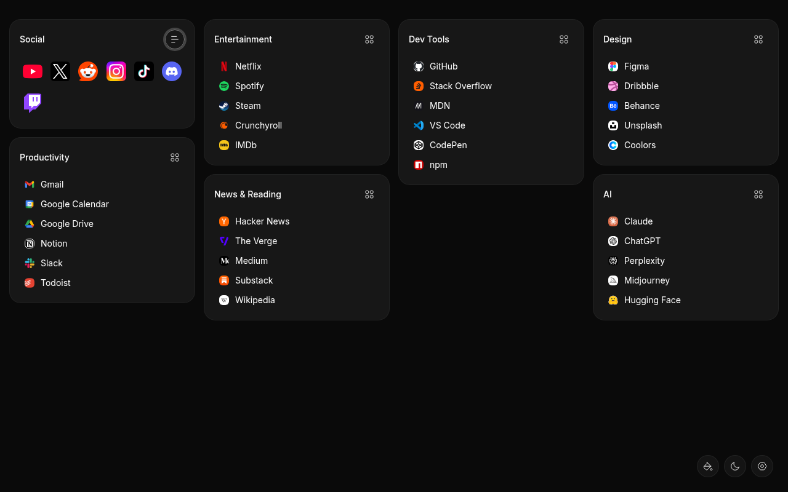
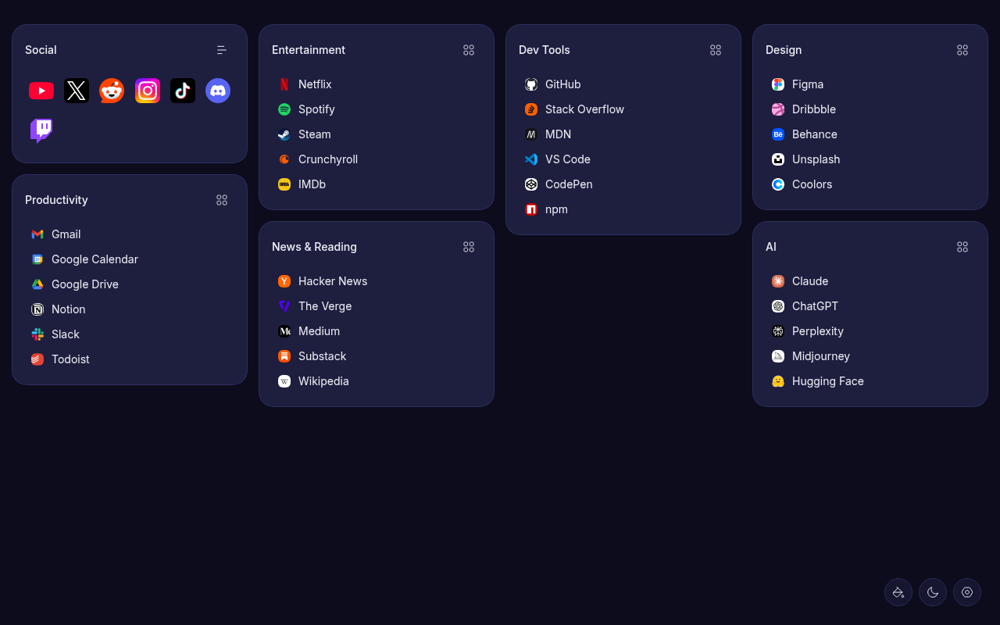
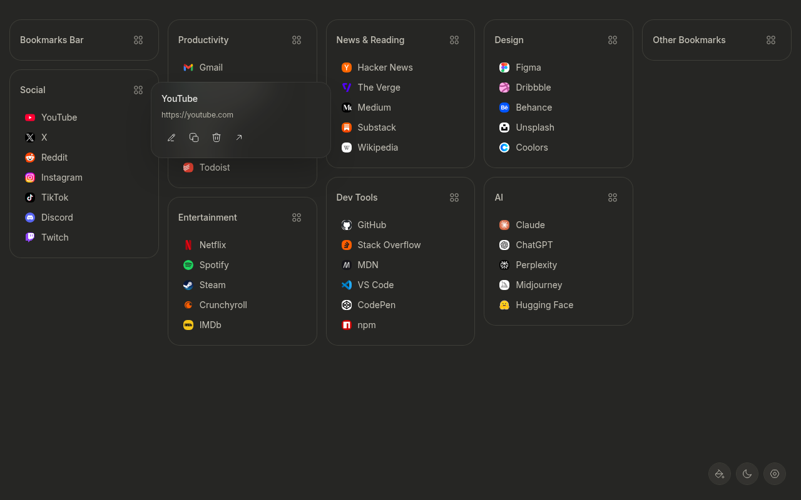
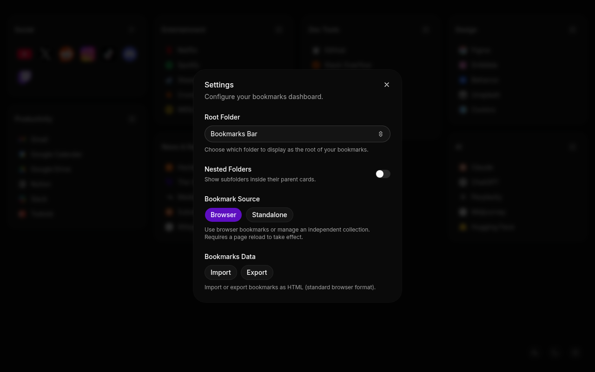
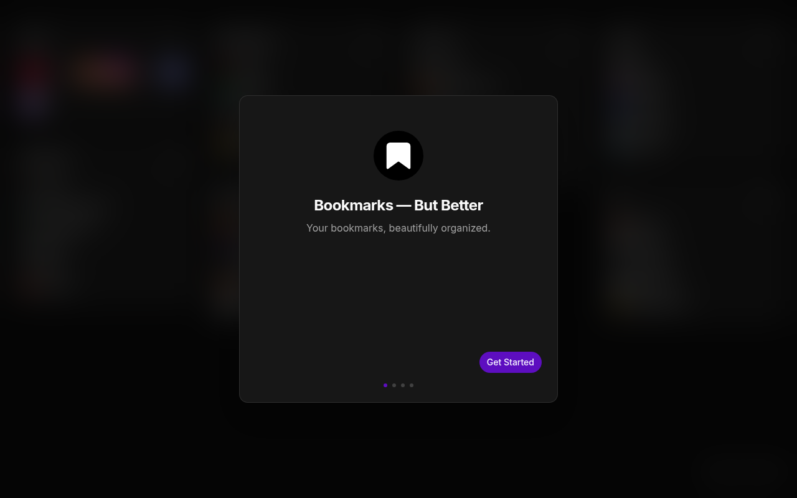

<p align="center">
  <picture>
    <source media="(prefers-color-scheme: dark)" srcset="public/logo.svg">
    <source media="(prefers-color-scheme: light)" srcset="public/logo-dark.svg">
    
  </picture>
</p>

<h1 align="center">Bookmarks - But Better</h1>

<p align="center">
  A clean, beautiful bookmarks dashboard that replaces your new tab page.
</p>

<p align="center">
  <a href="https://chromewebstore.google.com/detail/nflojekghnganlcjncbepnnnkgakghif?utm_source=github"></a>
  
</p>

<p align="center">
  <a href="https://chromewebstore.google.com/detail/nflojekghnganlcjncbepnnnkgakghif?utm_source=github">
    
  </a>
</p>

## Features

- **Masonry layout** — Bookmark folders displayed as cards in a responsive grid
- **Two view modes** — Switch between list and icon grid per folder
- **Inline editing** — Rename bookmarks, change URLs, edit folders — all inline
- **10 color themes** — Default, Amber, Bubblegum, Caffeine, Claude, Claymorphism, Cyberpunk, Solar Dusk, T3 Chat, Vintage Paper
- **Light & dark mode** — Follows system preference or toggle manually
- **Choose your root folder** — Display bookmarks from any folder
- **Import & export** — Standard HTML bookmark files
- **High-quality favicons** — Sharp icons on every display
- **Always in sync** — Changes saved directly to Chrome's bookmarks
- **100% private** — No analytics, no tracking, no data leaves your browser

## Install

<a href="https://chromewebstore.google.com/detail/nflojekghnganlcjncbepnnnkgakghif?utm_source=github"></a>

Or load manually:

1. Clone this repository
2. Run `bun install && bun run build`
3. Open `chrome://extensions`, enable **Developer mode**
4. Click **Load unpacked** and select the `dist/` folder

## Screenshots

<p align="center">
  
</p>

<p align="center">
  
</p>

<p align="center">
  
</p>

<p align="center">
  
</p>

## Development

```bash
bun install        # Install dependencies
bun dev            # Start dev server (standalone mode)
bun run build      # Build for production → dist/
bun run typecheck  # Type check
bun lint           # Lint
bun run format     # Format code
```

## Feedback & Issues

Found a bug or have a feature request? [Open an issue](../../issues) — all feedback is welcome.

## License

MIT
